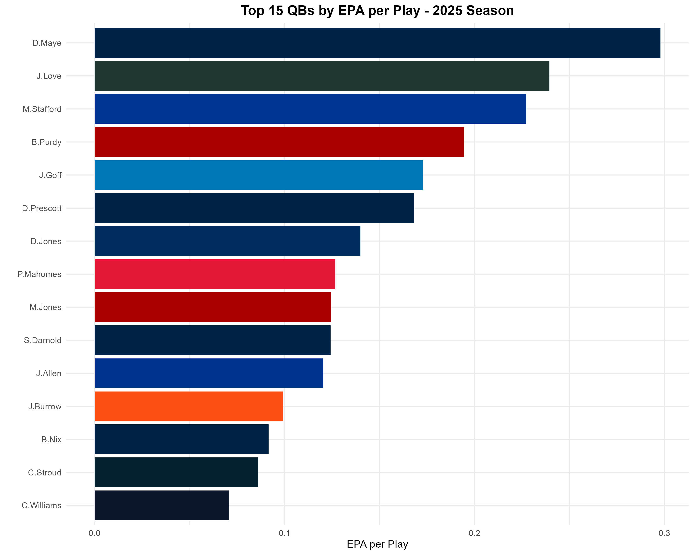
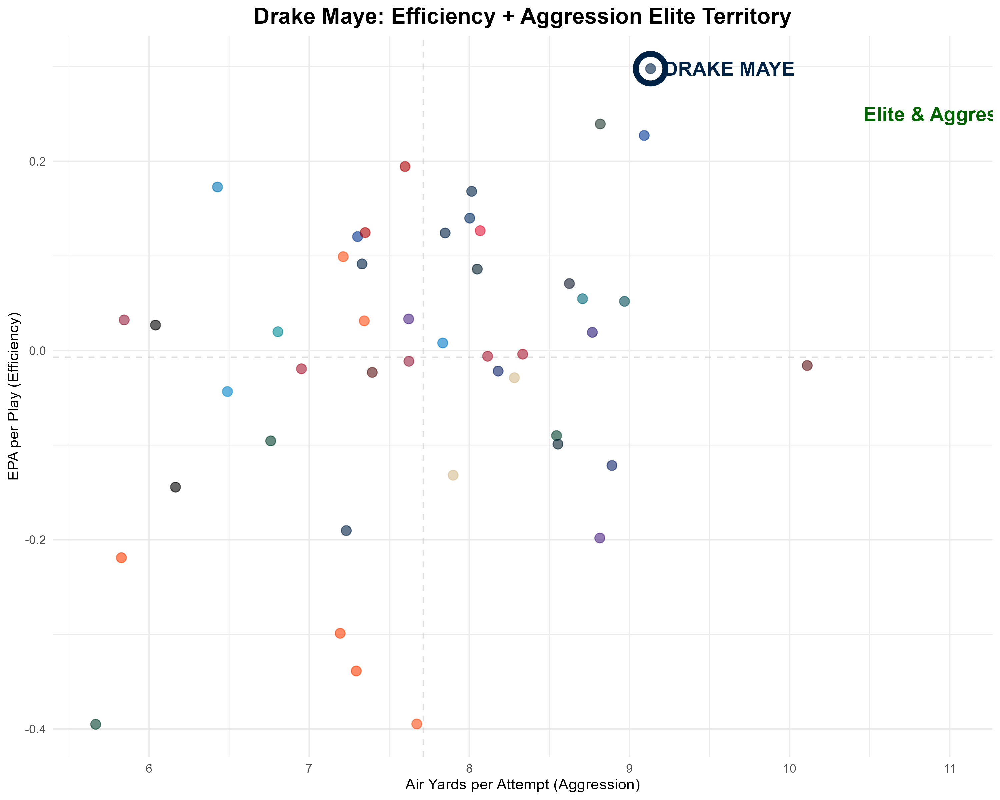
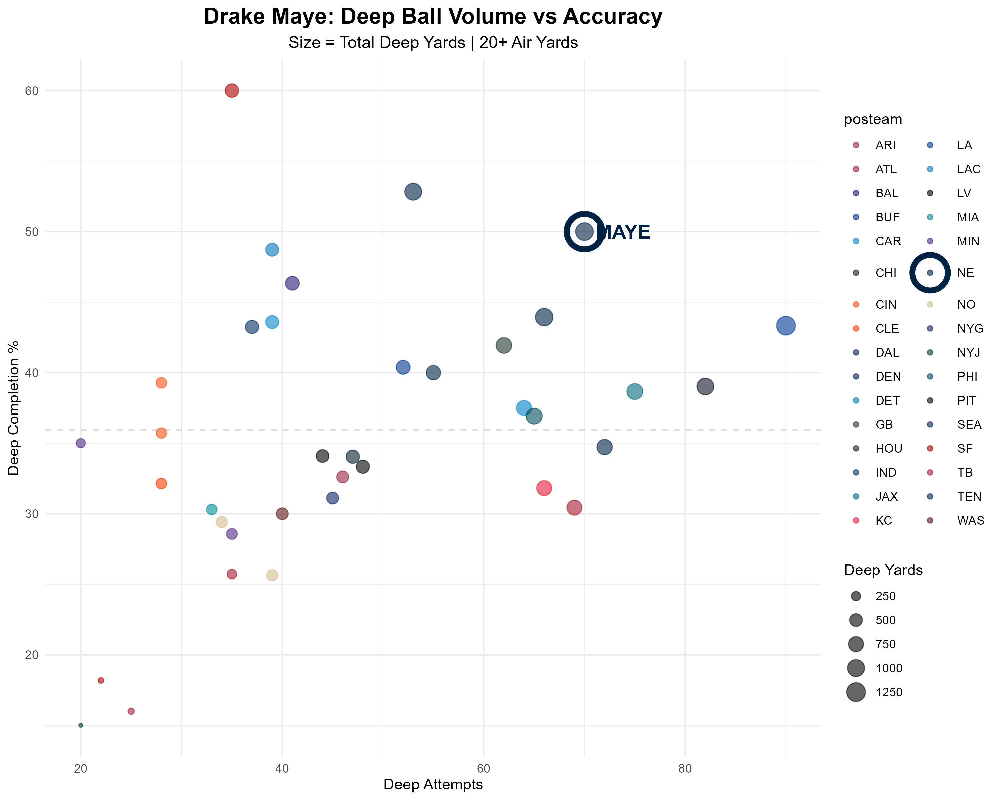
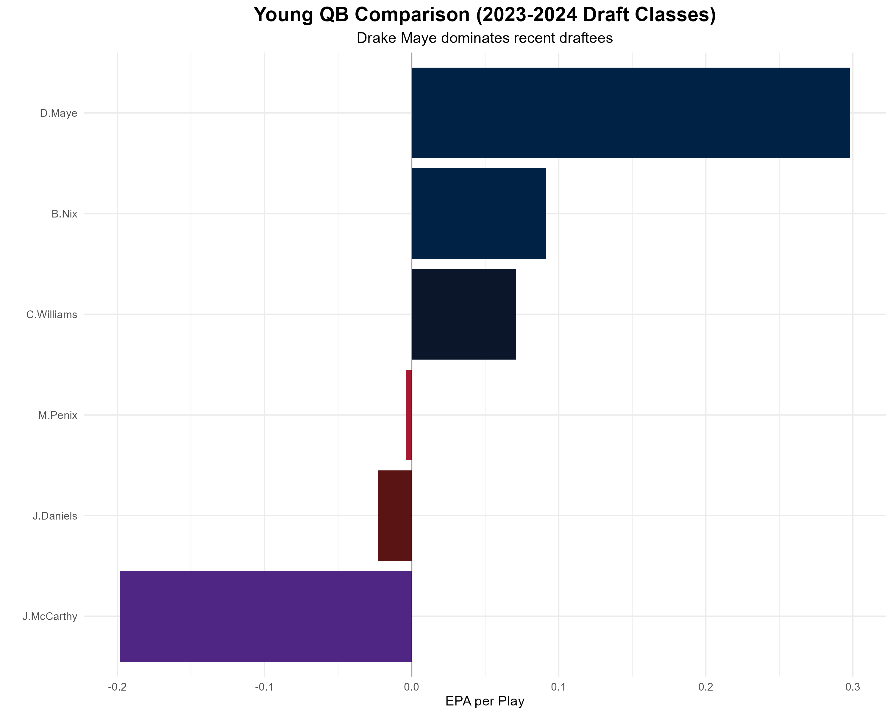
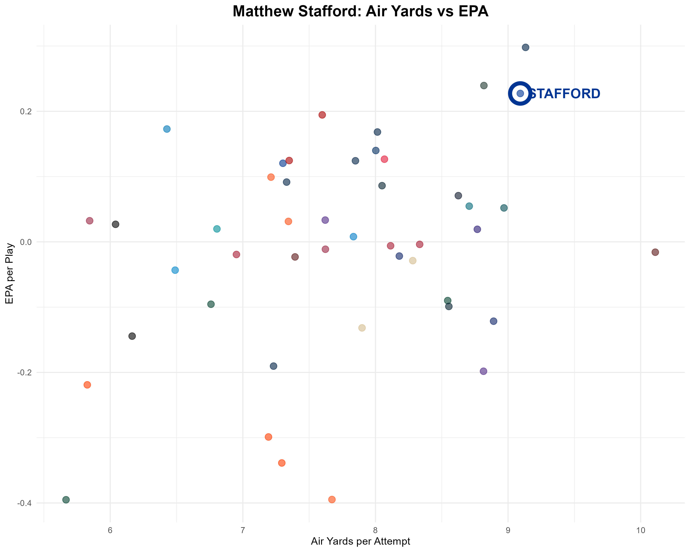
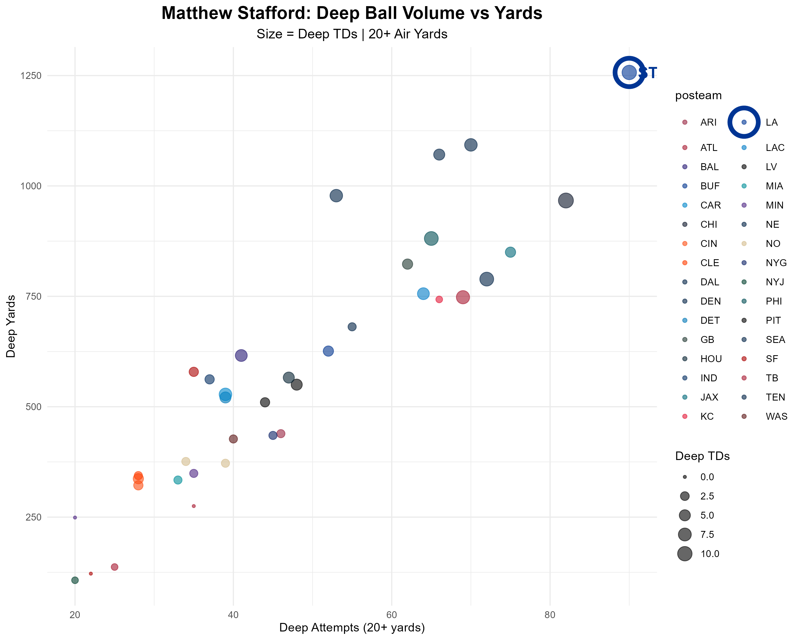
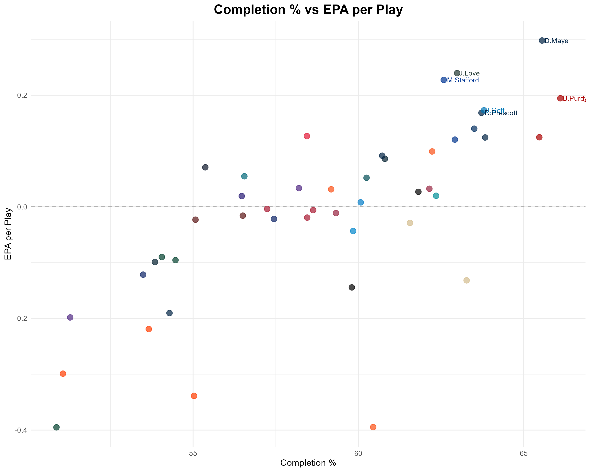
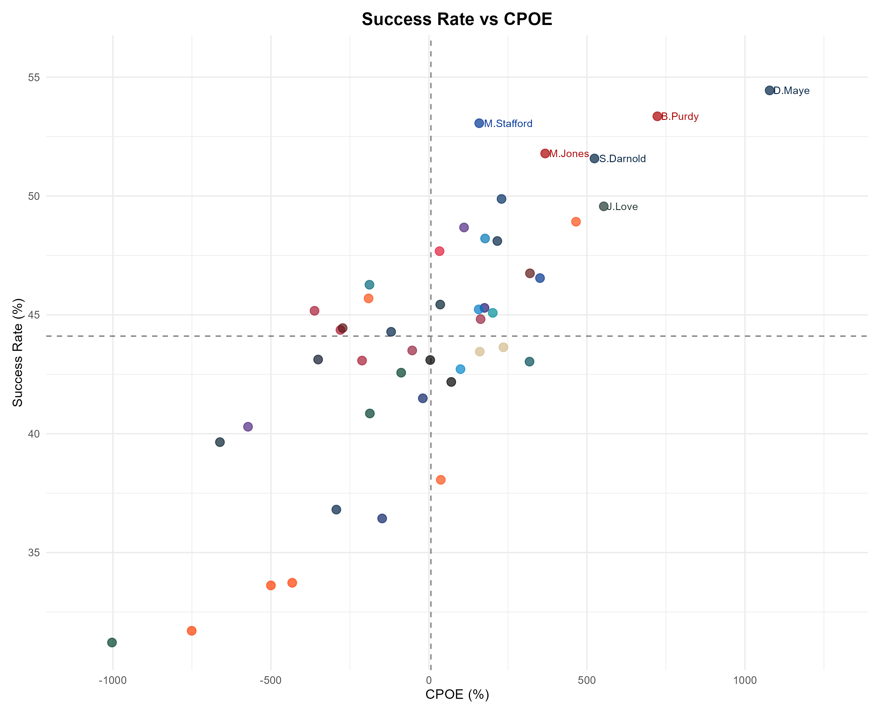

# NFL Quarterback Analysis - 2025 Season

Advanced statistical analysis of NFL quarterback performance using play-by-play data from the 2025 season.

**Built with [Claude Code](https://claude.ai/code)** | **Build Time:** ~2 hours | **Analysis Runtime:** ~2-3 minutes

> **Want to run this yourself?** See [QUICKSTART.md](QUICKSTART.md) for setup instructions.

---

## Executive Summary

Analysis of **46 starting quarterbacks** (100+ attempts) in the 2025 NFL regular season using advanced metrics including EPA (Expected Points Added), CPOE (Completion % Over Expected), success rate, and deep ball performance.

**Key Finding**: Drake Maye leads the league in efficiency with historic deep ball accuracy, while Matthew Stafford dominates volume deep passing.

---

## Top Performers

| Rank | QB | Team | EPA/Play | Success Rate | Comp % |
|------|-----|------|----------|--------------|--------|
| 1 | **Drake Maye** | NE | **0.298** | 54.4% | 65.6% |
| 2 | Jordan Love | GB | 0.239 | 49.6% | 63.0% |
| 3 | Matthew Stafford | LA | 0.227 | 53.1% | 62.6% |
| 4 | Brock Purdy | SF | 0.194 | 53.4% | 66.1% |
| 5 | Jared Goff | DET | 0.173 | 48.2% | 63.8% |

**League Averages:**
- EPA per play: -0.007 (slightly negative)
- Completion %: 59.0%
- Yards per attempt: 6.38
- TD Rate: 4.42% | INT Rate: 2.12%

---

## Drake Maye: The NFL's Most Efficient Quarterback

Drake Maye's 2025 season represents one of the most impressive quarterback performances in recent history. He leads the NFL in every major efficiency metric while maintaining elite aggression downfield.

### Historic Performance
- **#1 EPA/play (0.298)** - 25% better than #2 Jordan Love
- **#1 Success Rate (54.4%)** - 10.3% above league average (44.1%)
- **#1 CPOE (10.78)** - Completes difficult throws at historic rate
- **#1 Yards per Attempt (7.38)**
- **#1 Explosive Pass Rate (12.4%)**

### Deep Ball Mastery

**50% completion rate on deep balls (20+ air yards)** - This is historically elite.

Most quarterbacks either:
- Throw deep rarely and maintain accuracy, OR
- Throw deep frequently but struggle with completion rate

**Maye does both** - 70 deep attempts with 50% completion is unprecedented.

**Deep Ball Stats:**
- 70 attempts (Top 5 in NFL)
- 35 completions
- 1,093 yards (#2 in NFL)
- 50.0% completion (15% above league average of 35%)

### Among Young QBs (2023-2024 Draft Classes)

| Rank | QB | Team | EPA/Play |
|------|-----|------|----------|
| 1 | **Drake Maye** | **NE** | **0.298** |
| 2 | Bo Nix | DEN | 0.092 |
| 3 | Caleb Williams | CHI | 0.071 |
| 4 | Michael Penix | ATL | -0.004 |

Maye's EPA is **3.3x better** than the second-best young QB. This is a generational gap.

---

## Matthew Stafford: Elite Volume Deep-Ball Passer

Matthew Stafford represents a unique archetype: the elite volume deep-ball passer who maintains top-tier efficiency.

### Deep Ball Dominance

**#1 in the NFL with 1,257 deep yards** on 90 attempts - 164 yards ahead of #2.

**Deep Ball Stats:**
- **90 deep attempts** - Most aggressive downfield passer in NFL
- **43.3% completion** - 8.3% above league average
- **1,257 yards** - #1 in NFL by significant margin
- **10 TDs** - #2 in league

### The Stafford Formula

**High Volume + Deep Aggression + High Efficiency = Elite Production**

Most QBs sacrifice one of these three elements:
- Conservative QBs: High efficiency, low air yards
- Gunslingers: High air yards, lower efficiency
- Game managers: Lower volume, short passes

**Stafford achieves all three simultaneously**, making him uniquely valuable.

**Overall Rankings:**
- #1 Passing Yards
- #1 Touchdowns
- #3 EPA/play (0.227)
- #3 Air Yards/Attempt (9.09)

---

## Advanced Metrics Analysis

### Completion % vs EPA

Higher completion percentage doesn't always mean higher EPA. Context and difficulty matter - this is why CPOE is crucial for evaluating QB accuracy.

### Success Rate vs CPOE

Upper-right quadrant QBs (Maye, Stafford, Love) combine scheme success with individual accuracy - the hallmark of elite QB play.

---

## Key Insights

### 1. Efficiency Over Volume
Drake Maye leads in EPA/play despite fewer attempts than many peers. Quality over quantity drives winning football.

### 2. Deep Ball Variance
- **Elite deep passers**: 43%+ completion (Maye: 50%, Stafford: 43.3%)
- **League average**: 35% completion on 20+ yard throws
- **Struggling QBs**: Under 30%

### 3. Multiple Paths to Success
- **Maye's efficiency**: #1 in all advanced metrics
- **Stafford's volume**: Elite production through aggression
- **Love's balance**: Strong efficiency with sustainable approach
- **Mahomes' pedigree**: Winning despite not leading traditional stats

### 4. Young QB Development
The gap between Maye and other recent draftees (3.3x better EPA) shows that elite efficiency can emerge immediately with the right QB.

---

## Metrics Explained

**EPA (Expected Points Added)** - Value added per play relative to expected outcome. Best measure of overall QB effectiveness.

**CPOE (Completion % Over Expected)** - Accounts for throw difficulty (distance, pressure, coverage). Shows accuracy independent of scheme.

**Success Rate** - Percentage of plays that maintain or improve down-and-distance situation.

**Air Yards** - Distance ball travels in air from line of scrimmage to target. Measures downfield aggression.

**Deep Ball** - Throws with 20+ air yards. Elite QBs complete 43%+ of deep attempts.

---

## Files & Resources

**Analysis Scripts:** See `scripts/` directory
- `analyze_qbs.R` - Main analysis (run this)
- `maye_analysis.R` - Drake Maye deep dive
- `stafford_analysis.R` - Matthew Stafford analysis

**Outputs:**
- `output/qb_stats_2025.csv` - Complete dataset
- `output/QB_Report_2025.html` - Interactive HTML report
- `plots/` - 8 visualizations (PNG)

**Documentation:**
- `docs/QB_Analysis_2025.md` - Full written analysis
- `docs/slides.md` - Slidev presentation
- `QUICKSTART.md` - Setup & usage guide

---

## Data Source

Data sourced from [nflreadr](https://nflreadr.nflverse.com/) R package - official NFL play-by-play data.

## License

MIT License - Copyright (c) 2026 Alyssa Pybus

## Acknowledgments

- [nflverse](https://www.nflverse.com/) for the nflreadr package
- NFL for publicly available play-by-play data
- Built with R, dplyr, ggplot2, and Claude Code

---

**Season Analyzed**: 2025 NFL Regular Season | **QBs Analyzed**: 46 (minimum 100 attempts) | **Last Updated**: January 2026
