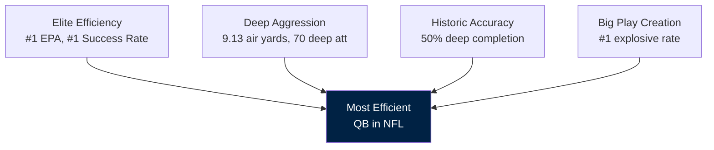
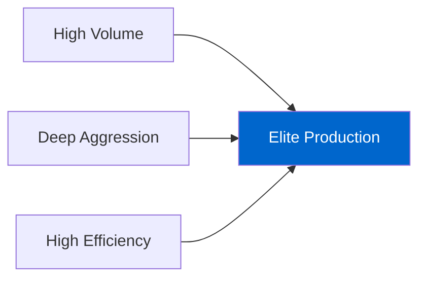

# NFL Quarterback Analysis
## 2025 Season Performance Review

Using Advanced Metrics & Play-by-Play Data

  
    Press Space for next page <carbon:arrow-right class="inline"/>
  

---
layout: default
---

# Executive Summary

<v-clicks>

- **46 starting quarterbacks** analyzed (100+ attempts minimum)
- Data from **2025 NFL regular season** play-by-play
- Metrics: EPA, CPOE, Success Rate, Deep Ball Performance
- Clear performance tiers emerge from the data
- Unique playing styles identified across the league

</v-clicks>

### Key Insight
Traditional stats (yards, TDs) don't tell the full story - **efficiency metrics reveal true value**

---
layout: two-cols
---

# Top 10 QBs by EPA/Play

| Rank | QB | Team | EPA/Play |
|------|-----|------|----------|
| 1 | Drake Maye | NE | 0.298 |
| 2 | Jordan Love | GB | 0.239 |
| 3 | **Matthew Stafford** | **LA** | **0.227** |
| 4 | Brock Purdy | SF | 0.194 |
| 5 | Jared Goff | DET | 0.173 |
| 6 | Dak Prescott | DAL | 0.168 |
| 7 | Daniel Jones | IND | 0.140 |
| 8 | Patrick Mahomes | KC | 0.127 |
| 9 | Mac Jones | SF | 0.125 |
| 10 | Sam Darnold | SEA | 0.124 |

::right::

## Elite Tier
<v-clicks>

- **Drake Maye** leads all QBs
  - 65.6% completion rate
  - 54.4% success rate

- **Jordan Love** proves sustainability
  - Strong second year

- **Matthew Stafford** - volume king
  - 620 attempts, elite EPA

</v-clicks>

---
layout: default
---

# League-Wide Statistics

## Averages Across 46 QBs

| Metric | Value |
|--------|-------|
| EPA per Play | -0.007 |
| Completion % | 59.0% |
| Yards/Attempt | 6.38 |
| TD Rate | 4.42% |
| INT Rate | 2.12% |

## What This Means

- Slightly negative average EPA
- Nearly 3:2 TD to INT ratio
- Wide variance between elite and average
- Top QBs significantly above mean

---
layout: center
class: text-center
---

# Drake Maye
## Deep Dive Analysis

The NFL's Most Efficient Quarterback

---
layout: two-cols
---

# Maye's Historic Rankings

| Category | Rank | Value |
|----------|------|-------|
| **EPA per Play** | **#1** | 0.298 |
| **Success Rate** | **#1** | 54.4% |
| **CPOE** | **#1** | 10.78 |
| **YPA** | **#1** | 7.38 |
| Completion % | **#2** | 65.6% |
| Deep Yards | **#2** | 1,093 |
| Air Yards/Att | **#2** | 9.13 |
| Explosive Rate | **#1** | 12.4% |

::right::

## What This Means

<v-clicks>

🏆 **#1 in all efficiency metrics**
- Best EPA in NFL
- Best success rate
- Best CPOE (accuracy)

⚡ **Elite aggression too**
- #2 in air yards/attempt
- #2 in deep ball yards
- #1 in explosive plays

🎯 **The complete package**

</v-clicks>

---
layout: default
---

# Maye's Deep Ball Excellence
## 20+ Air Yards Analysis

### Maye's Deep Stats

- **70 attempts** - Top 5 in NFL
- **35 completions**
- **50.0% completion rate**
- **1,093 yards** - #2 in NFL
- **7 TDs**

### Historic Accuracy

- League average: **35.0%** completion
- Maye: **+15.0%** above average
- **50% deep completion** is elite
- Only QB over 50% on 70+ attempts

## The Maye Deep Ball Formula

**High Volume + Historic Accuracy = Deep Ball Dominance**

Most QBs are either accurate on low volume OR inaccurate on high volume. Maye breaks the mold.

---
layout: default
---

# Efficiency Dominance

## Maye's Numbers

- **0.298 EPA/play** - #1
- **54.4% success rate** - #1
- **10.78 CPOE** - #1
- **46.4% 3rd down success** - Top 5

## League Context

- Average EPA: **-0.007**
- Average success: **44.1%**
- Maye is **+10.3%** above average on success rate
- This gap is historically significant

### Key Insight

Maye doesn't just lead efficiency metrics - he **dominates** them. 0.298 EPA is 25% better than #2 Jordan Love (0.239).

---
layout: default
---

# Young QB Comparison
## 2023-2024 Draft Classes

| Rank | QB | Team | EPA/Play | Success % | Deep Att |
|------|-----|------|----------|-----------|----------|
| 1 | **D. Maye** | **NE** | **0.298** | **54.4%** | **70** |
| 2 | B. Nix | DEN | 0.092 | 44.3% | 72 |
| 3 | C. Williams | CHI | 0.071 | 43.1% | 82 |
| 4 | M. Penix | ATL | -0.004 | 45.2% | 35 |
| 5 | J. Daniels | WAS | -0.023 | 44.4% | 18 |
| 6 | J. McCarthy | MIN | -0.198 | 40.3% | 35 |

### The Gap

Maye's **0.298 EPA** is **3.3x better** than the #2 young QB (Nix at 0.092). This is a generational performance.

---
layout: default
---

# The Drake Maye Formula

### Most Young QBs
Struggle with volume
Learning curve
Inconsistent

### Good Young QBs
Show flashes
Above average efficiency
Potential

### Drake Maye
**Best in NFL**
All categories
🌟🌟🌟

---
layout: center
class: text-center
---

# Matthew Stafford
## Deep Dive Analysis

The Elite Volume Deep-Ball Passer

---
layout: two-cols
---

# Stafford's Rankings

| Category | Rank | Percentile |
|----------|------|------------|
| Total Yards | **#1** | Top 2% |
| Total TDs | **#1** | Top 2% |
| EPA per Play | **#3** | Top 7% |
| Deep Yards | **#1** | Top 2% |
| Deep TDs | **#2** | Top 4% |
| Air Yards/Att | **#3** | Top 7% |
| Yards/Att | **#3** | Top 7% |

::right::

## The Pattern

<v-clicks>

✅ **#1 in volume stats**
- Most passing yards
- Most touchdowns (tied)

✅ **#1 in deep ball**
- Most deep yards
- Most deep attempts

✅ **Top 3 in efficiency**
- EPA, YPA, Air Yards

🎯 **Unique combination**

</v-clicks>

---
layout: default
---

# Deep Ball Dominance
## 20+ Air Yards Analysis

### Stafford's Deep Stats

- **90 attempts** - #1 in NFL
- **39 completions**
- **43.3% completion rate**
- **1,257 yards** - #1 by 164 yards
- **10 TDs** - #2 in league

### League Context

- League average: **35.0%** completion
- Stafford: **+8.3%** above average
- 20 more attempts than #2 QB
- Maintains efficiency at high volume

## Top 3 Deep Passers

1. **M. Stafford (LA)** - 1,257 yards, 90 att
2. **D. Maye (NE)** - 1,093 yards, 70 att
3. **D. Prescott (DAL)** - 1,071 yards, 66 att

---
layout: default
---

# Air Yards Leadership

## Air Yards per Attempt - Top 5

| Rank | QB | Team | Air Yards/Att | EPA/Play |
|------|-----|------|---------------|----------|
| 1 | M. Mariota | WAS | 10.1 | -0.016 ❌ |
| 2 | D. Maye | NE | 9.13 | 0.298 ✅ |
| 3 | **M. Stafford** | **LA** | **9.09** | **0.227** ✅ |
| 4 | J. Hurts | PHI | 8.97 | 0.052 |
| 5 | R. Wilson | NYG | 8.89 | -0.122 ❌ |

### Key Insight

Stafford throws **9.09 air yards/attempt** - **1.38 yards deeper** than league average (7.71)

**And maintains top-3 efficiency** - this is what makes him elite

---
layout: default
---

# The Stafford Formula

### Most QBs
Conservative
High Efficiency
Low Air Yards

### Some QBs
Gunslingers
High Air Yards
Lower Efficiency

### Stafford
All Three
**Simultaneously**
⭐

---
layout: default
---

# Key Findings

<v-clicks>

## 1. Efficiency > Volume
Drake Maye leads in EPA/play with fewer attempts than peers

## 2. Deep Ball Variance
Elite: 43%+ completion | Average: 35% | Struggling: <30%

## 3. Traditional Stats Mislead
Mahomes #8 in EPA despite championships - context matters

## 4. Success Rate + CPOE = True Value
Upper-right quadrant QBs (Maye, Stafford, Love) most valuable

</v-clicks>

---
layout: default
---

# Quarterback Archetypes

### Efficient Aggressors
- Drake Maye
- Jordan Love
- Deep + Accurate

### Volume Dominators
- Matthew Stafford
- High attempts + Production

### Pocket Efficiency
- Brock Purdy
- Jared Goff
- System excellence

### Championship Pedigree
- Patrick Mahomes
- Winning > Stats

## Success comes in many forms - but efficiency is king

---
layout: default
---

# Methodology

## Data Source
- **nflreadr** R package
- Official NFL play-by-play
- 2025 regular season
- 100+ attempt minimum

## Tools
- R with dplyr, ggplot2
- Advanced statistical analysis
- Team color integration

## Key Metrics

**EPA** - Expected Points Added
Value per play vs average

**CPOE** - Completion % Over Expected
Difficulty-adjusted accuracy

**Success Rate** - Binary play outcome
Down-and-distance improvement

**Air Yards** - Downfield aggression
Pre-catch ball travel

---
layout: default
---

# Visualizations Created

<v-clicks>

1. Top 15 QBs by EPA/Play (bar chart)
2. Completion % vs EPA scatter plot
3. Yards vs Touchdowns bubble chart
4. Success Rate vs CPOE quadrant analysis
5. TD:INT Ratio rankings
6. Stafford Air Yards positioning
7. Stafford Deep Ball volume vs success
8. Stafford Percentile rankings

</v-clicks>

All charts use official **NFL team colors** for visual consistency

---
layout: center
class: text-center
---

# Conclusions

<v-clicks>

✅ **Drake Maye** - Most efficient QB in 2025

✅ **Matthew Stafford** - Elite volume deep-ball specialist

✅ **Jordan Love** - Sustainable breakout performance

✅ **Multiple paths to success** - Efficiency, volume, scheme

✅ **Advanced metrics reveal true value** - Look beyond yards/TDs

</v-clicks>

---
layout: center
class: text-center
---

# Thank You

## NFL QB Analysis 2025

**Data:** nflreadr R package
**Analysis:** R with dplyr, ggplot2, tidyr
**Season:** 2025 NFL Regular Season

Files: qb_analysis_2025.R | stafford_analysis.R | qb_stats_2025.csv

